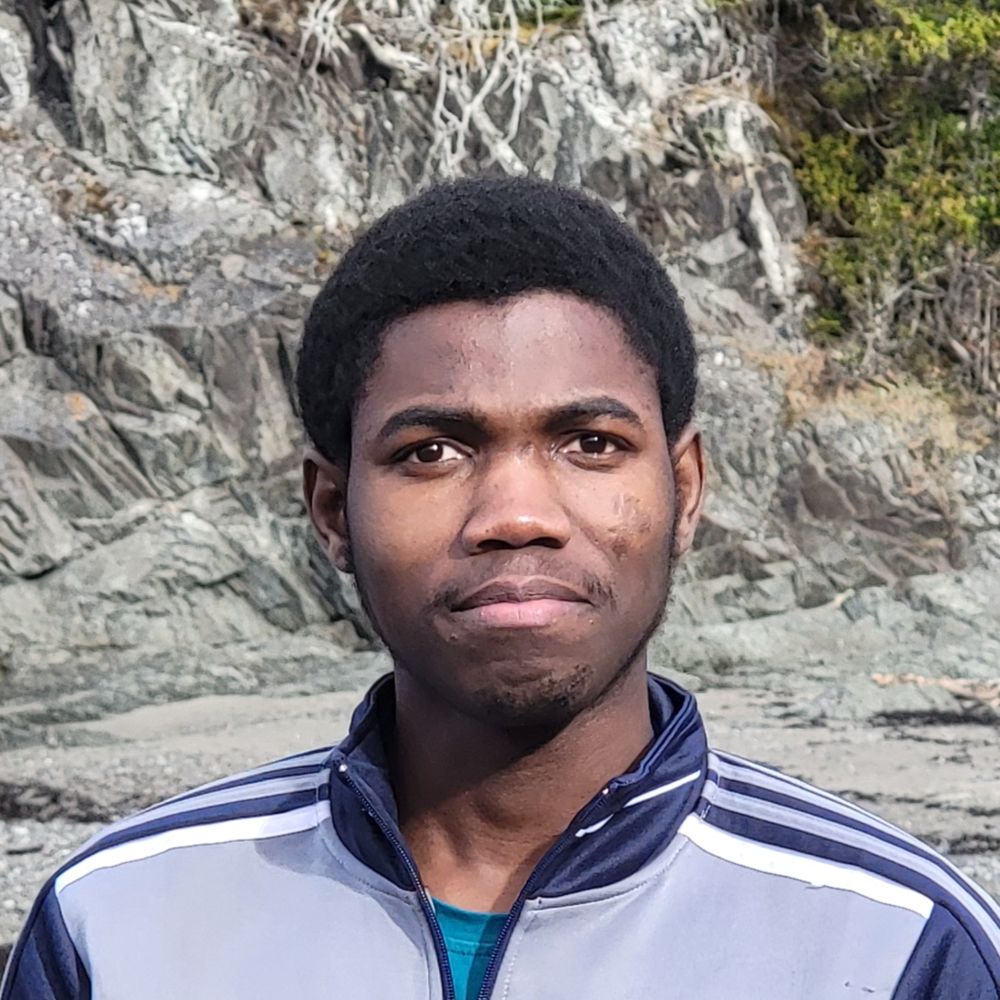

::: {.certificate}
::: {.cert-grid}
{.cert-photo fig-alt="Brice Piaple Dada" fig-align="center"}

::: {.cert-text}
::: {.cert-name}
Brice Piaple Dada
:::

::: {.cert-role}
Computer Technician
:::

::: {.cert-desc}
A graduate of the DEC in Computer Science at Cégep de Rimouski, I have hands-on experience in software development and database administration. Passionate about object-oriented programming (C#) and problem solving, I am recognized for my teamwork and positive attitude.
:::

::: {.cert-actions}
[View my Portfolio](portfolio/index.qmd){.btn-seal}
[Download my CV (FR)](../CV/Brice_Piaple_Dada_CV_Fr.pdf){.btn-ink}
[Download my CV (EN)](../CV/Brice_Piaple_Dada_CV_En.pdf){.btn-ink}
:::
:::
:::

::: {.cert-footer}
::: {.cert-signature}
::: {.sig-line}
:::
::: {.sig-name}
Brice Piaple Dada
:::
::: {.sig-role}
Computer Technician — Ville de Rimouski
:::
:::

<svg class="cert-seal" viewBox="0 0 140 140" role="img" aria-label="Sealed file">
  <circle cx="70" cy="70" r="70" fill="none" stroke="currentColor" stroke-width="3.5" stroke-dasharray="0.5 6.2"/>
  <circle cx="70" cy="70" r="62" fill="none" stroke="currentColor" stroke-width="2"/>
  <circle cx="70" cy="70" r="55" fill="none" stroke="currentColor" stroke-width="1" stroke-dasharray="1 5"/>
  <circle cx="70" cy="70" r="44" fill="none" stroke="currentColor" stroke-width="1.5"/>
  <text x="70" y="66" text-anchor="middle" font-family="var(--font-display)" font-weight="900" font-size="34" fill="currentColor">BP</text>
  <text x="70" y="84" text-anchor="middle" font-family="var(--font-mono)" font-size="8.5" letter-spacing="2.5" fill="currentColor">2026</text>
</svg>

::: {.cert-legend}
SEALED FILE · Rimouski, Québec — August 2026
:::
:::
:::

---

::: {.piece}
::: {.piece-head}
::: {.piece-ref}
Exhibit N° 1
:::
::: {.piece-rule}
:::
:::

::: {.piece-title}
What I Do
:::

::: {.piece-sub}
Three fields I am passionate about and practice every day.
:::

::: {.explore-grid}

::: {.doc-card}
<i class="bi bi-shield-check" aria-hidden="true"></i>

::: {.doc-title}
Cybersecurity & Administration
:::

::: {.doc-body}
System hardening, identity and access management, Windows Server and Active Directory administration.
:::
[Learn more](about.qmd#sysres){.doc-link}

[Contact](contact.qmd){.doc-link}
:::

::: {.doc-card}
<i class="bi bi-code-slash" aria-hidden="true"></i>

::: {.doc-title}
Software Development
:::

::: {.doc-body}
C# .NET applications, REST APIs, SQL databases and complete academic projects.
:::
[Learn more](about.qmd#dev){.doc-link}

[Portfolio](portfolio/index.qmd){.doc-link}
:::

::: {.doc-card}
<i class="bi bi-cloud-arrow-up" aria-hidden="true"></i>

::: {.doc-title}
Cloud & Infrastructure
:::

::: {.doc-body}
Azure services, VMware virtualization, containerization and CI/CD deployment.
:::

[Learn more](about.qmd#devops){.doc-link}
:::

:::
:::

---

::: {.piece}
::: {.piece-head}
::: {.piece-ref}
Exhibit N° 2
:::
::: {.piece-rule}
:::
:::

::: {.piece-title}
Skills
:::

::: {.piece-sub}
A showcase of the tools and technologies I master.
:::

::: {.tech-block}
[C# (.NET)]{.tag} [Python]{.tag} [C++]{.tag} [JavaScript]{.tag} [HTML5/CSS3]{.tag} [SQL]{.tag} [Elastic Search]{.tag} [PostgreSQL]{.tag} [Azure]{.tag} [Windows Server]{.tag} [Active Directory]{.tag} [PowerShell]{.tag} [VMware]{.tag} [Git]{.tag} [GitHub]{.tag} [CI/CD]{.tag}
:::

---

::: {.piece}
::: {.piece-head}
::: {.piece-ref}
Exhibit N° 3
:::
::: {.piece-rule}
:::
:::

::: {.piece-title}
Achievements
:::

::: {.piece-sub}
Selected projects that show the breadth of my skills — from development to infrastructure.
:::

::: {.explore-grid}

::: {.project-card}
::: {.project-head}
::: {.project-index}
01
:::
::: {.project-title}
.NET Web Application (C#)
:::
::: {.project-tags}
[C#]{.tag} [ASP.NET Core]{.tag} [API REST]{.tag} [SQL]{.tag}
:::

::: {.project-body}
Complete web application (frontend + backend) with RESTful API and SQL database, built in C# (.NET).
:::

[View project on GitHub](https://github.com/bpiaple){.doc-link}
:::

::: {.project-card}
::: {.project-head}
::: {.project-index}
02
:::
::: {.project-title}
Cloud and Windows Server Infrastructure
:::
::: {.project-tags}
[Windows Server]{.tag} [Active Directory]{.tag} [Azure]{.tag} [VMware]{.tag}
:::

::: {.project-body}
Virtualized Windows Server environments, Azure services integration and Active Directory administration.
:::

[View project on GitHub](https://github.com/bpiaple){.doc-link}
:::

::: {.project-card}
::: {.project-head}
::: {.project-index}
03
:::
::: {.project-title}
Portfolio Website with CI/CD
:::
::: {.project-tags}
[GitHub Pages]{.tag} [GitHub Actions]{.tag} [Quarto]{.tag} [Markdown]{.tag}
:::

::: {.project-body}
Personal website with automated deployment to GitHub Pages via GitHub Actions (CI/CD).
:::

[View project on GitHub](https://github.com/bpiaple){.doc-link}
:::

:::
:::

---

::: {.piece}
::: {.piece-head}
::: {.piece-ref}
Exhibit N° 4
:::
::: {.piece-rule}
:::
:::

::: {.piece-title}
Career
:::

::: {.piece-sub}
An overview of my journey and recent projects.
:::

::: {.timeline}

::: {.timeline-item}
::: {.tl-date}
March 2026 — Present · Rimouski
:::
::: {.tl-org}
Ville de Rimouski
:::
::: {.tl-role}
IT Technician
:::
::: {.tl-desc}
First- and second-level support, Microsoft 365 administration, Windows Server, Active Directory and technical documentation.
:::
:::

::: {.timeline-item}
::: {.tl-date}
Jan. 2022 — Jul. 2023 · Yaoundé, Cameroon
:::
::: {.tl-org}
Yoco Sarl Services
:::
::: {.tl-role}
Software Developer
:::
::: {.tl-desc}
Development and maintenance of software solutions, technical documentation and system optimization.
:::
:::

::: {.timeline-item}
::: {.tl-date}
March 2021 — June 2021 · Yaoundé, Cameroon
:::
::: {.tl-org}
MTN Cameroon
:::
::: {.tl-role}
Software Development Intern
:::
::: {.tl-desc}
Development of internal applications, database administration and user technical support.
:::
:::

::: {.timeline-item}
::: {.tl-date}
August 2023 — May 2026 · Rimouski
:::
::: {.tl-org}
Cégep de Rimouski
:::
::: {.tl-role}
DEC in Computer Science Techniques
:::
::: {.tl-desc}
Training in programming, cybersecurity, networking, databases and systems administration.
:::
:::

:::
:::

---

::: {.piece}
::: {.piece-head}
::: {.piece-ref}
Exhibit N° 5
:::
::: {.piece-rule}
:::
:::

::: {.piece-title}
Soft Skills
:::

::: {.piece-sub}
Qualities that make the difference every day.
:::

::: {.tag-cloud}
[Autonomy]{.tag} [Rigor]{.tag} [Teamwork]{.tag} [Clear Communication]{.tag} [Problem Solving]{.tag} [Service Orientation]{.tag}
:::
